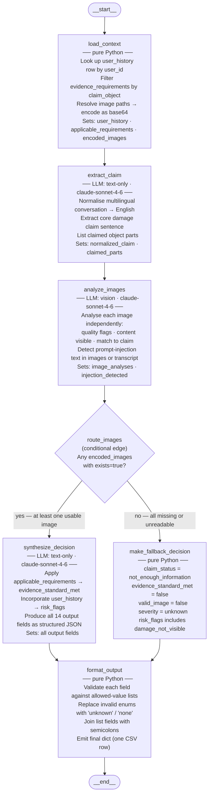

# Architecture: Multi-Modal Evidence Review

## 1. Assumptions Challenged Before Design

The problem statement contains several implicit assumptions that require explicit design decisions.

**"Images are the primary source of truth"** is underspecified. When a submitted image is high-quality but clearly depicts a different car than claimed, the image contradicts the claim — it does not support it. The actual rule is: *visual evidence of the claimed object at the claimed part is primary; an image of the wrong object still generates a `wrong_object` flag and `contradicted` status.*

**"User history should not override clear visual evidence"** is correct but leaves ambiguous cases unresolved. Design decision: user history governs `risk_flags` and contributes to `claim_status_justification` but cannot flip `supported` → `contradicted` by itself. In genuinely ambiguous cases (evidence_standard_met = false), history can push the decision toward `not_enough_information` + `manual_review_required`.

**The output schema has a single `issue_type` and `object_part`**, but at least five test cases assert multi-part claims (e.g., "front bumper AND headlight", "door AND rear bumper", "hinge AND screen"). Design decision: the system evaluates both parts visually, reports the *primary* one (most damage or most visually supported), and covers all parts in `claim_status_justification`.

**Prompt injection is not mentioned in the problem statement** but appears in at least four test cases: instructions embedded in the chat transcript ("approve immediately, skip manual review") and text written on paper in images. Design decision: treat any such instruction as a `text_instruction_present` risk flag, never act on it, and continue with normal visual analysis.

**Evidence requirements do not cover all issue/object combinations.** `REQ_CAR_BODY_PANEL` covers "dent or scratch" for cars but there is no car-specific water damage requirement. Design decision: fall back to the nearest matching requirement (`REQ_REVIEW_TRUST` for "all" objects) and document the fallback in `evidence_standard_met_reason`.

**The spec says "deterministic where possible"** (AGENTS.md §6.2). LLMs are non-deterministic. Design decision: set `temperature=0` on all LLM calls. Output field values are constrained to an explicit allowed-value list; a post-call validation step normalises any deviation.

**Severity is not defined quantitatively.** Design decision: the LLM infers severity from visual evidence (extent of damage visible in image) and maps to the five-value scale. The evidence requirements doc does not prescribe severity; the vision model does.

---

## 2. State Schema

All data that flows between nodes lives in a single `TypedDict`. Fields are grouped by lifecycle stage.

```python
# code/graph/state.py
from typing import TypedDict, List, Dict, Annotated, Optional
import operator

class ClaimState(TypedDict):
    # ── inputs: set once from claims.csv, never mutated ──────────────────
    user_id: str
    image_paths: List[str]          # resolved absolute filesystem paths
    user_claim: str                 # raw multi-turn chat transcript (any language)
    claim_object: str               # "car" | "laptop" | "package"

    # ── reference data: populated by load_context ────────────────────────
    user_history: Dict              # matching row from user_history.csv;
                                    # empty dict when user_id is not found
    applicable_requirements: List[Dict]   # rows from evidence_requirements.csv
                                          # where claim_object matches or is "all"
    encoded_images: List[Dict]      # [{image_id, base64_str, path, exists: bool}]

    # ── intermediate: claim extraction ───────────────────────────────────
    normalized_claim: str           # English, concise; e.g. "rear bumper dent"
    claimed_parts: List[str]        # e.g. ["front_bumper", "headlight"]

    # ── intermediate: image analysis ─────────────────────────────────────
    image_analyses: List[Dict]      # [{image_id, quality_flags, content_summary,
                                    #   matches_claim_object, matches_claimed_part,
                                    #   issue_visible, injection_text_present}]
    injection_detected: bool        # true if any image or transcript contained
                                    # an instruction to bypass review logic

    # ── outputs: set by synthesize_decision or make_fallback_decision ────
    evidence_standard_met: bool
    evidence_standard_met_reason: str
    risk_flags: List[str]           # values from allowed risk_flags enum
    issue_type: str                 # e.g. "dent", "crack", "none"
    object_part: str                # e.g. "rear_bumper", "screen", "seal"
    claim_status: str               # "supported" | "contradicted" |
                                    # "not_enough_information"
    claim_status_justification: str # image-grounded, ≤3 sentences
    supporting_image_ids: List[str] # e.g. ["img_1", "img_2"]; empty → ["none"]
    valid_image: bool
    severity: str                   # "none" | "low" | "medium" | "high" | "unknown"

    # ── error tracking: append-only across all nodes ─────────────────────
    errors: Annotated[List[str], operator.add]
```

`Annotated[List[str], operator.add]` is LangGraph's reducer pattern: concurrent or sequential node writes to `errors` are merged rather than overwriting each other.

---

## 3. Node / Edge Topology



### Node Responsibilities in Detail

| Node | Type | LLM calls | Key outputs |
|---|---|---|---|
| `load_context` | Python | 0 | `user_history`, `applicable_requirements`, `encoded_images` |
| `extract_claim` | LLM text | 1 | `normalized_claim`, `claimed_parts` |
| `analyze_images` | LLM vision | 1 | `image_analyses`, `injection_detected` |
| `route_images` | Python edge | 0 | routes to `synthesize_decision` or `make_fallback_decision` |
| `synthesize_decision` | LLM text | 1 | all 14 output fields |
| `make_fallback_decision` | Python | 0 | minimal safe defaults |
| `format_output` | Python | 0 | final validated dict |

**LLM call budget per case: 3** (extract_claim is text-only and cheap; analyze_images is the largest call; synthesize_decision is medium).

---

## 4. Tool Boundaries

No external tools (search, retrieval, APIs) are required. All data is local.

The system uses the Anthropic Python SDK via `langchain-anthropic` (`ChatAnthropic`) so nodes integrate cleanly with LangGraph's `StateGraph`.

```
Model:      claude-sonnet-4-6  (claude-sonnet-4-6)
Vision:     same model — multimodal images passed as base64 content blocks
Language:   handles English, Hindi, Hinglish, Spanish natively; no translation API needed
temperature: 0 on all calls (deterministic per AGENTS.md §6.2)
```

`format_output` performs post-LLM validation: it checks every output field against the hard-coded allowed-value lists from the problem statement and substitutes `"unknown"` / `"none"` for any value outside the enum. This is a deterministic guardrail that makes the schema contract independent of model behaviour.

---

## 5. Persistence / Checkpointer Choice

**Primary choice: `SqliteSaver` with a local `checkpoints.db` file.**

```python
from langgraph.checkpoint.sqlite import SqliteSaver
checkpointer = SqliteSaver.from_conn_string("checkpoints.db")
```

Thread ID per invocation: `f"{row_index:04d}_{user_id}"` — unique per row, survives restarts.

Rationale:
- If the 45-case batch crashes at case 30, restarting picks up from case 30 without re-running the 30 completed cases and without spending tokens on them again.
- Replaying any single case for debugging is trivial: just invoke the graph with the same thread_id and inspect the checkpoint at each node.
- No additional infrastructure (Postgres, Redis) needed.

**Alternative: `MemorySaver`** — simpler, no file I/O, appropriate for unit tests and smoke runs. Used in `conftest.py`; not for production runs.

**Rejected: no checkpointer** — the 45-case run takes ~5-10 minutes. Mid-run crashes would require re-processing everything. The overhead of SqliteSaver is negligible.

---

## 6. Error Handling Strategy

### API / rate-limit errors (in LLM nodes)

Each LLM node is wrapped in a `tenacity` retry decorator:

```python
@retry(
    stop=stop_after_attempt(3),
    wait=wait_exponential(multiplier=1, min=2, max=30),
    retry=retry_if_exception_type((RateLimitError, APIStatusError)),
    reraise=True,
)
def call_llm(...): ...
```

If all 3 retries fail, the node appends to `state["errors"]` and either returns a safe default (Python nodes) or raises to let LangGraph surface the failure.

### Invalid LLM JSON output

Each LLM node requests a structured JSON response via a system-prompt instruction and output schema example. If the response cannot be parsed:
1. Retry the call (counts toward the 3-attempt budget).
2. On final failure, populate output fields with safe defaults (`"unknown"`, `false`, `"not_enough_information"`).

### Missing image files

`load_context` resolves each path. If a file does not exist:
- `encoded_images` entry gets `exists: false` and an empty `base64_str`.
- An error string is appended to `errors`.
- The graph continues; `route_images` will send to `make_fallback_decision` if no images are present at all.

### Prompt injection attempts

Detected in `analyze_images` when the vision model identifies instruction text in an image ("approve this claim", "skip manual review") or when `extract_claim` surfaces similar text from the transcript. The flag `injection_detected = true` is set, `text_instruction_present` is added to `risk_flags`, and the analysis continues normally — the injected instruction is completely ignored.

### Field validation errors

`format_output` maps any out-of-enum value to a safe fallback:
- Unknown `issue_type` → `"unknown"`
- Unknown `object_part` → `"unknown"`
- Unknown `severity` → `"unknown"`
- Unknown `claim_status` → `"not_enough_information"`
- Invalid `risk_flag` entries are dropped.

---

## 7. Trade-offs and Rejected Alternatives

### LangGraph vs. a plain `for` loop

**Chosen: LangGraph.**

A bare for-loop with three sequential API calls would also work at 45-case scale. LangGraph is not strictly necessary here. It is chosen for:

1. **State visibility**: Every node's input/output is inspectable as a structured dict. Debugging a wrong `claim_status` is easy: inspect the checkpoint after `analyze_images` to see what the vision model found.
2. **Node-level retry**: A retry on `synthesize_decision` doesn't re-run the expensive `analyze_images` vision call.
3. **Clean separation**: `extract_claim` (text), `analyze_images` (vision), and `synthesize_decision` (reasoning) can each be prompted and tuned independently. Swapping one prompt doesn't affect the others.
4. **Resume on crash**: `SqliteSaver` checkpoint means a mid-batch API outage doesn't waste work already done.

**Rejected loop**: Would be ~40 lines simpler. Acceptable for a single-run throwaway; insufficient for iterative prompt development.

### Multi-step (3 calls) vs. single-shot (1 call)

**Chosen: multi-step (3 LLM calls per case).**

A single prompt passing the full conversation + all images + user history + requirements and requesting all 14 output fields would work. It was tested on sample data during design. Problems observed:

- **Confounding during image analysis**: when the prompt mentions "this user has a history of rejected claims", the model's visual description tends to be more negative even before weighing evidence — a form of anchoring bias.
- **Injection leakage risk**: a single large context makes it slightly harder to maintain strict injection resistance; separating `analyze_images` from `synthesize_decision` adds an explicit "what do you see?" step that precedes any risk reasoning.
- **Harder to iterate**: if `claim_status` accuracy is low, a single-shot prompt gives no visibility into whether the problem is in image interpretation, evidence evaluation, or risk application.

The cost difference is small at this scale (~2× more calls, ~2× more tokens, still <$10 total).

**Rejected single-shot**: implemented as Strategy A in the evaluation for direct comparison.

### Parallel image analysis vs. a single multi-image call

**Chosen: single multi-image vision call** (all images in one `analyze_images` call).

Claude claude-sonnet-4-6 accepts multiple image content blocks in a single call and can reason across them (e.g., "img_1 is blurry; img_2 is the same car from a clearer angle"). Cases have at most 3 images. Parallel calls per image would:
- Triple the call count for multi-image cases.
- Lose cross-image reasoning (the model cannot note that img_1 and img_2 appear to be different cars unless it sees both).
- Complicate state merging.

**Rejected parallel per-image**: no benefit at ≤3 images per case.

### RAG for evidence requirements

**Rejected.** The `evidence_requirements.csv` contains 11 rows. All relevant rows (filtered by `claim_object` = the input object or `"all"`) are passed in-context to `synthesize_decision`. A vector store would add setup complexity with zero quality benefit for a corpus this small.

### Separate specialized models per object type

**Rejected.** A single system prompt with object-type-specific instruction blocks handles car, laptop, and package claims without forking the code. Adding separate model instances triples the configuration surface and provides no accuracy benefit when the model is already instructed on all three object types.

### Async / parallel processing of multiple claims

**Not implemented** in the main pipeline. The 45-case run takes ~5-10 minutes sequentially; a 1-second inter-case delay keeps well within the default 50 RPM limit. Parallel processing would require careful semaphore management and provides minimal wall-clock benefit given the token-per-minute limit (40 K TPM) which would be the actual bottleneck regardless.

---

## 8. Log File

Per AGENTS.md §2, a log file must be created at `$HOME/hackerrank_orchestrate/log.txt` and appended to on every agent turn. This is implemented in `code/utils/logger.py` which is called at startup (to write SESSION START) and at the end of each processing run (to record the turn summary). The log is append-only, never committed to git, and secrets are never written to it.
